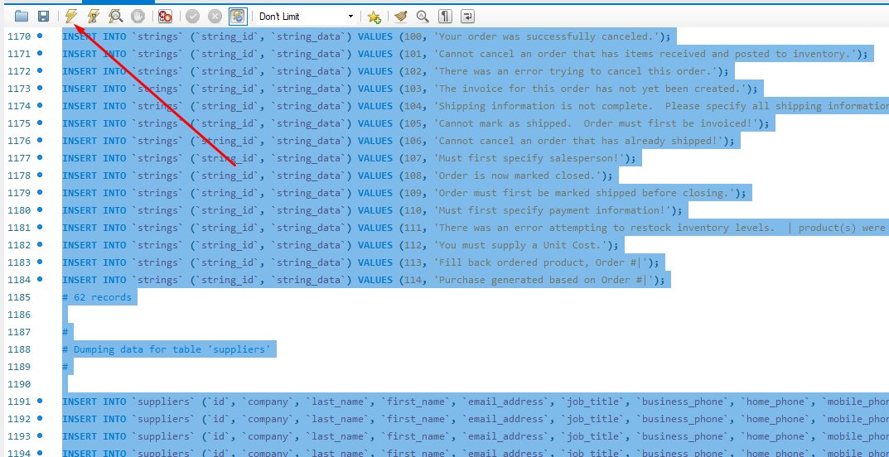
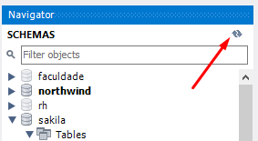
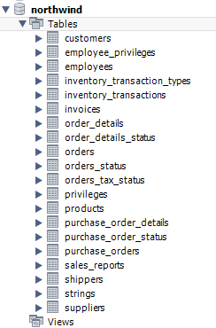
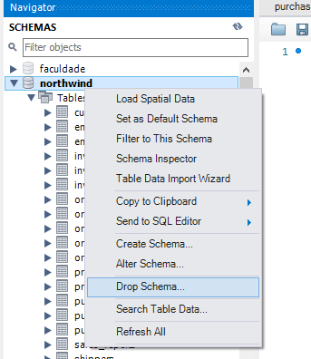

# Boas vindas ao repositório do projeto All For One

Para desenvolver os projetos, você deverá seguir as instruções a seguir. Fique atento a cada passo, e se tiver qualquer dúvida, nos envie por _Slack_! #vqv 🚀

Aqui você vai encontrar os detalhes de como estruturar o desenvolvimento do seu projeto a partir desse repositório, utilizando uma branch específica e um _Pull Request_ para colocar seus códigos.

---

### Termos e acordos

Ao iniciar este projeto, você concorda com as diretrizes do Código de Conduta e do Manual da Pessoa Estudante da Trybe

---

# Entregáveis

<details>
  <summary><strong>👨‍💻 O que deverá ser desenvolvido</strong></summary><br />

Hoje você fará um projeto com o codinome *All For One* em que praticará todos os conceitos de SQL já ensinados até aqui. Porém, você vai usar um banco de dados totalmente diferente, então dê tchau para o `sakila` e dê boas vindas ao `Northwind`, que será usado neste projeto. As instruções de como restaurar o banco podem ser lidas a seguir.
</details>

<details>
  <summary><strong>👨‍💻 Desenvolvimento</strong></summary><br />

Temos, nesse projeto, uma série de desafios com diferentes níveis de complexidade que devem ser resolvidos cada um em seu arquivo próprio.

1. Leia a pergunta e crie na raiz do projeto um arquivo chamado desafioN.sql, em que N é o número do desafio;

2. O arquivo deve conter apenas o código SQL do desafio resolvido. **Não se esqueça de incluir o ponto e vírgula (";")** no final de suas queries e também de colocar o nome do **banco_de_dados.tabela_por_completo**, como no exemplo a seguir:

```sql
SELECT * FROM northwind.orders;
```

3. Faça isso até finalizar todos os desafios.

4. Para entregar o seu projeto você deverá criar um _Pull Request_ neste repositório. Este _Pull Request_ deverá conter os arquivos `desafio1.sql`, `desafio2.sql` e assim por diante até o `desafio27.sql`, que conterão seu código `SQL` de cada desafio, respectivamente.

5. **Não é necessário colocar** `USE northwind` ou `SET SQL_SAFE_UPDATES = 0;` no início dos seus arquivos.

6. Após a execução dos teste locais, o banco de dados `northwind` é deletado.

### ⚠️ É importante que seus arquivos tenham exatamente estes nomes! ⚠️

Você pode adicionar outros arquivos se julgar necessário. Qualquer dúvida, procure a monitoria.

Lembre-se que você pode consultar nosso conteúdo sobre [Git & GitHub](https://app.betrybe.com/course/4d67f5b4-34a6-489f-a205-b6c7dc50fc16/) e nosso [Blog - Git & GitHub](https://blog.betrybe.com/tecnologia/git-e-github/) sempre que precisar!
 </details>

<details>
  <summary><strong>🗓 Data de Entrega</strong></summary><br />

- Projeto individual.

- Serão `1` dias de projeto.

- Data de entrega para avaliação final do projeto: `01/06/2022 14:00`.
  </details>

# Orientações

<details>
  <summary><strong>:whale: Rodando no Docker vs Localmente</strong></summary><br />
  
  ## Com Docker
 
  **:warning: Antes de começar, seu docker-compose precisa estar na versão 1.29 ou superior. [Veja aqui](https://www.digitalocean.com/community/tutorials/how-to-install-and-use-docker-compose-on-ubuntu-20-04-pt) ou [na documentação](https://docs.docker.com/compose/install/) como instalá-lo. No primeiro artigo, você pode substituir onde está com `1.26.0` por `1.29.2`.**
  
  > :information_source: Rode os serviços `node` e `db` com o comando `docker-compose up -d`.
  - Lembre-se de parar o `mysql` se estiver usando localmente na porta padrão (`3306`), ou adapte, caso queria fazer uso da aplicação em containers
  - Esses serviços irão inicializar um container chamado `all_for_one` e outro chamado `all_for_one_db`.
  - A partir daqui você pode rodar o container `all_for_one` via CLI ou abri-lo no VS Code.

  > :information_source: Use o comando `docker exec -it all_for_one bash`.
  - Ele te dará acesso ao terminal interativo do container criado pelo compose, que está rodando em segundo plano.
  - As credencias de acesso ao banco de dados estão definidas no arquivo `docker-compose.yml`, e são acessíveis no container através das variáveis de ambiente `MYSQL_USER` e `MYSQL_PASSWORD`. 💡

  > :information_source: Instale as dependências [**Caso existam**] com `npm install`. (Instale dentro do container)
  
  - **:warning: Atenção:** Caso opte por utilizar o Docker, **TODOS** os comandos disponíveis no `package.json` (npm start, npm test, npm run dev, ...) devem ser executados **DENTRO** do container, ou seja, no terminal que aparece após a execução do comando `docker exec` citado acima. 

  - **:warning: Atenção:** O **git** dentro do container não vem configurado com suas credenciais. Ou faça os commits fora do container, ou configure as suas credenciais do git dentro do container.

  - **:warning: Atenção:** Não rode o comando npm audit fix! Ele atualiza várias dependências do projeto, e essa atualização gera conflitos com o avaliador.

  - ✨ **Dica:** A extensão `Remote - Containers` (que estará na seção de extensões recomendadas do VS Code) é indicada para que você possa desenvolver sua aplicação no container Docker direto no VS Code, como você faz com seus arquivos locais.

  

  <br />
  
  ## Sem Docker 
  
  > :information_source: Instale as dependências [**Caso existam**] com `npm install`
  
  - **:warning: Atenção:** Não rode o comando npm audit fix! Ele atualiza várias dependências do projeto, e essa atualização gera conflitos com o avaliador.

  - **✨ Dica:** Para rodar o projeto desta forma, obrigatoriamente você deve ter o `node` instalado em seu computador.
  - **✨ Dica:** O avaliador espera que a versão do `node` utilizada seja a 16.

  <br/>
</details>

<details>
  <summary><strong>‼️ Antes de começar a desenvolver</strong></summary><br />

1. Clone o repositório
  * `git clone https://github.com/tryber/sd-019-a-mysql-all-for-one.git`.
  * Entre na pasta do repositório que você acabou de clonar:
    * `cd sd-019-a-mysql-all-for-one`

2. Instale as dependências [**Caso existam**]
  * `npm install` [**exemplo**]

3. Crie uma branch a partir da branch `master`
  * Verifique que você está na branch `master`
    * Exemplo: `git branch`
  * Se não estiver, mude para a branch `master`
    * Exemplo: `git checkout master`
  * Agora, crie uma branch onde você vai guardar os `commits` do seu projeto
    * Você deve criar uma branch no seguinte formato: `nome-de-usuario-nome-do-projeto`
    * Exemplo: `git checkout -b seunome-mysql-all-for-one`

4. Para cada exercício você deve criar um novo arquivo sql seguindo a seguinte estrutura:
  * desafio1.sql, desafio2.sql...desafioN.sql
  * 💡 Use o seguinte comando para gerar os arquivos: `touch desafio{1..27}.sql`

5. Adicione as mudanças ao _stage_ do Git e faça um `commit`
  * Verifique que as mudanças ainda não estão no _stage_
    * Exemplo: `git status` (deve aparecer o arquivo que você alterou como desafio1.sql)
  * Adicione o novo arquivo ao _stage_ do Git
      * Exemplo:
        * `git add .` (adicionando solução para desafio 1)
        * `git status` (deve aparecer listado o arquivo _desafio1.sql_ em verde)
  * Faça o `commit` inicial
      * Exemplo:
        * `git commit -m 'iniciando o projeto MySQL All For One'` (fazendo o primeiro commit)
        * `git status` (deve aparecer uma mensagem tipo _nothing to commit_ )

6. Adicione a sua branch com o novo `commit` ao repositório remoto
  * Usando o exemplo anterior: `git push -u origin seunome-mysql-all-for-one`

7. Crie um novo `Pull Request` _(PR)_
  * Vá até a página de _Pull Requests_ do [repositório no GitHub](https://github.com/tryber/sd-019-a-mysql-all-for-one/pulls)
  * Clique no botão verde _"New pull request"_
  * Clique na caixa de seleção _"Compare"_ e escolha a sua branch **com atenção**
  * Clique no botão verde _"Create pull request"_
  * Adicione uma descrição para o _Pull Request_ e clique no botão verde _"Create pull request"_
  * **Não se preocupe em preencher mais nada por enquanto!**
  * Volte até a [página de _Pull Requests_ do repositório](https://github.com/tryber/sd-019-a-mysql-all-for-one/pulls) e confira que o seu _Pull Request_ está criado

</details>

<details>
  <summary><strong>⌨️ Durante o desenvolvimento</strong></summary><br />

## ⚠️ É importante que seus arquivos tenham exatamente estes nomes e esteja na raiz do projeto! ⚠️

* Faça `commits` das alterações que você fizer no código regularmente.

* Lembre-se de sempre após um (ou alguns) `commits` atualizar o repositório remoto.

* Os comandos que você utilizará com mais frequência são:
  1. `git status` _(para verificar o que está em vermelho - fora do stage - e o que está em verde - no stage)_
  2. `git add` _(para adicionar arquivos ao stage do Git)_
  3. `git commit` _(para criar um commit com os arquivos que estão no stage do Git)_
  4. `git push -u nome-da-branch` _(para enviar o commit para o repositório remoto na primeira vez que fizer o `push` de uma nova branch)_
  5. `git push` _(para enviar o commit para o repositório remoto após o passo anterior)_

</details>

</details>

<details>
  <summary><strong>🤝 Depois de terminar o desenvolvimento (opcional)</strong></summary><br />

  Para sinalizar que o seu projeto está pronto para o _"Code Review"_ dos seus colegas, faça o seguinte:

* Vá até a página **DO SEU** _Pull Request_, adicione a label de _"code-review"_ e marque seus colegas:

  * No menu à direita, clique no _link_ **"Labels"** e escolha a _label_ **code-review**;

  * No menu à direita, clique no _link_ **"Assignees"** e escolha **o seu usuário**;

  * No menu à direita, clique no _link_ **"Reviewers"** e digite `students`, selecione o time `tryber/students-sd-019-a`.

Caso tenha alguma dúvida, [aqui tem um video explicativo](https://vimeo.com/362189205).

  </details>

<details>
  <summary><strong>🕵🏿 Revisando um pull request</strong></summary><br />

  Use o conteúdo sobre [Code Review](https://course.betrybe.com/real-life-engineer/code-review/) para te ajudar a revisar os _Pull Requests_.

</details>

<details>
  <summary><strong>🗒️ Instruções para restaurar o banco de dados `Northwind`</strong></summary><br />

1. Faça o download do arquivo de backup [aqui](northwind.sql) clicando em "Raw", depois clicando com botão direito e selecionando "Salvar como" para salvar o arquivo em seu computador.
2. Abra o arquivo com algum editor de texto e selecione todo o conteúdo do arquivo usando `CTRL-A`.
3. Abra o MySQL Workbench.
4. Abra uma nova janela de query e cole dentro dela todo o conteúdo do arquivo `northwind.sql`.
5. Selecione todo o código com o atalho `CTRL-A` e depois clique no ícone de raio para executar a query.

    
6. Aguarde alguns segundos (espere em torno de 30 segundos antes de tentar fazer algo).
7. Clique no botão apontado na imagem a seguir para atualizar a listagem de banco de dados.

    
7. Verifique se o banco restaurado possui todas as seguintes tabelas:

    
8. Clique com botão direito em cada tabela e selecione "Select Rows" e certifique-se que todas as tabelas possuem registros. Caso tenha alguma faltando, faça o passo a seguir. Caso contrário, pode ir para próxima seção.
9. Caso existam tabelas faltando, drope o banco de dados clicando com o botão direito em cima do banco de dados northwind e selecionando "Drop Schema" e refaça os passos novamente, dessa vez aguardando um tempo maior quando executar o script de restauração.

    

</details>

<details>
  <summary><strong>📑 Instruções para testar suas queries</strong></summary><br />

#### Para executar os testes locais com Docker 🐋

- Após ter seguido os passos anteriores do `docker-compose up -d` e `docker exec -it all_for_one bash`, dentro do terminal interativo do container, rode:
```sh
npm test
```

#### Para executar os testes locais usando a instalação do MySQL feita na sua máquina 💻

- Para executar localmente os testes é preciso escrever o seguinte no seu terminal:
```sh
MYSQL_USER=<SEU_NOME_DE_PESSOA_USUARIA> MYSQL_PASSWORD=<SUA SENHA> HOSTNAME=<NOME_DO_HOST> PORT=<PORTA> npm test
```

- Não esqueça de substituir os locais indicados com `< >` por suas credenciais:
```sh
MYSQL_USER=root MYSQL_PASSWORD=password HOSTNAME=localhost PORT=3306 npm test
```

#### Dicas e pontos de atenção

- ✨ **Dica:** variáveis de ambiente definidas na mesma linha do comando valem apenas para aquele comando. Se preferir, você pode exportar as variáveis de ambiente para toda a _sessão_ (todos os comandos até você fechar aquele terminal). Por exemplo:
```sh
export MYSQL_USER=root MYSQL_PASSWORD=password HOSTNAME=localhost PORT=3306
```
> E depois disso você só precisa rodar `npm test` quando for testar os projetos.

- ✨ **Dica:** Caso queira utilizar _Docker_ para rodar os testes localmente, basta executar o comando:
```sh
docker run -p 3306:3306 --name mysql_57 -e MYSQL_ROOT_PASSWORD=1234 -d mysql:5.7 mysqld --default-authentication-plugin=mysql_native_password
```
- Depois de usar o comando acima, agora basta executar os testes digitando no terminal:
```sh
MYSQL_USER=root MYSQL_PASSWORD=1234 HOSTNAME=localhost npm test
```

<details close>
  <summary>O que está sendo feito na dica acima</summary>
  <br>

  - :point_right: flag --name:
  > Define um nome para o nosso _container_: "meu-mysql-5_7".

  - :point_right: flag -e:
  > Define a variável de ambiente "MYSQL_ROOT_PASSWORD" com o valor "1234".

  - :point_right: flag -d:
  > Define que o container rode em segundo plano.

  - :point_right: flag -p:
  > Mapeia uma porta local a uma porta do _container_.

  - :point_right: mysql:5.7:
  > Define qual versão da imagem  mySQL queremos, no caso, a 5.7, que é a esperada pelo avaliador.
</details>

- **:warning: Atenção:** O avaliador espera que a versão do  MySQL seja a 5.7. Em caso de erro nos testes, verifique se essa é a versão que está sendo usada por você.

- **:warning: Atenção:** Não é necessário colocar `USE northwind` ou `SET SQL_SAFE_UPDATES = 0;` no início dos seus arquivos

- **:warning: Atenção:** Após a execução dos teste locais, o banco de dados `northwind` é deletado :warning:

</details>

  <details>
  <summary><strong>🗣 Nos dê feedbacks sobre o projeto!</strong></summary><br />

Ao finalizar e submeter o projeto, não se esqueça de avaliar sua experiência preenchendo o formulário.
**Leva menos de 3 minutos!**

[FORMULÁRIO DE AVALIAÇÃO DE PROJETO](https://be-trybe.typeform.com/to/ZTeR4IbH)

:warning: **O avaliador automático não necessariamente avalia seu projeto na ordem em que os requisitos aparecem no readme. Isso acontece para deixar o processo de avaliação mais rápido. Então, não se assuste se isso acontecer, ok?**

</details>

<details>
  <summary><strong>🗂 Compartilhe seu portfólio!</strong></summary><br />

  Você sabia que o LinkedIn é a principal rede social profissional e compartilhar o seu aprendizado lá é muito importante para quem deseja construir uma carreira de sucesso? Compartilhe esse projeto no seu LinkedIn, marque o perfil da Trybe (@trybe) e mostre para a sua rede toda a sua evolução.

</details>

  ---

# Requisitos do projeto

Monte queries para encontrar as informações esperadas pelos desafios:

## Desafios Iniciais

1 - Exiba apenas os nomes dos produtos na tabela `products`.

  ---
  
2 - Exiba os dados de todas as colunas da tabela `products`.

  ---
  
3 - Escreva uma query que exiba os valores da coluna que representa a primary key da tabela `products`.

  ---
  
4 - Conte quantos registros existem na coluna `product_name` da tabela `products`.

  ---
  
5 - Monte uma query que exiba os dados da tabela `products` a partir do quarto registro até o décimo terceiro.

<details>
  <summary>&nbsp;&nbsp;<strong>👀 Observações técnicas</strong></summary>

  - Tanto o quarto quanto o décimo terceiro registros, precisam aparecer na consulta;

  - Não use `where` ou `order by`.

  <br />
</details>

  ---
  
6 - Exiba os dados das colunas `product_name` e `id` da tabela `products` de maneira que os resultados estejam em ordem alfabética dos nomes.

  ---
  
7 - Mostre apenas os ids dos 5 últimos registros da tabela `products` (a ordernação deve ser baseada na coluna `id`).

  ---
  
8 - Faça uma consulta que retorne três colunas, respectivamente, com os nomes 'A', 'Trybe' e 'eh', e com valores referentes a soma de '5 + 6', a string 'de', a soma de '2 + 8'.

<details>
  <summary>&nbsp;&nbsp;<strong>👀 Observações técnicas</strong></summary>

  - Na primeira coluna, exiba a soma de `5 + 6` (essa soma deve ser realizada pelo SQL);
  
  - Na segunda coluna deve haver a palavra \"de\";
  
  - E por fim, na terceira coluna, exiba a soma de `2 + 8` (essa soma deve ser realizada pelo SQL);
  
  - A primeira coluna deve se chamar \"A\", a segunda coluna deve se chamar \"Trybe\" e a terceira coluna deve se chamar \"eh\";
  
  - Não use colunas pré-existentes, apenas o que for criado na hora.

  <br />
</details>

## Desafios sobre filtragem de dados

9 - Mostre todos os valores de `notes` da tabela `purchase_orders` que não são nulos.

  ---
  
10 - Mostre todos os dados da tabela `purchase_orders` em ordem decrescente, ordenados por `created_by` em que o `created_by` é maior ou igual a 3.

<details>
  <summary>&nbsp;&nbsp;<strong>👀 Observações técnicas</strong></summary>

  - Como critério de desempate para a ordenação, ordene também os resultados pelo `id` de forma crescente.

  <br />
</details>

  ---
  
11 - Exiba os dados da coluna `notes` da tabela `purchase_orders` em que seu valor de `Purchase generated based on Order` é maior ou igual a 30 e menor ou igual a 39.

  ---
  
12 - Mostre as `submitted_date` de `purchase_orders` em que a `submitted_date` é do dia 26 de abril de 2006.

  ---
  
13 - Mostre o `supplier_id` das `purchase_orders` em que o `supplier_id` seja 1 ou 3.

  ---
  
14 - Mostre os resultados da coluna `supplier_id` da tabela `purchase_orders` em que o `supplier_id` seja maior ou igual a 1 e menor ou igual 3.

  ---
  
15 - Mostre somente as horas (sem os minutos e os segundos) da coluna `submitted_date` de todos registros da tabela `purchase_orders`.

<details>
  <summary>&nbsp;&nbsp;<strong>👀 Observações técnicas</strong></summary>

  - Chame essa coluna de `submitted_hour`.

  <br />
</details>

  ---
  
16 - Exiba a `submitted_date` das `purchase_orders` que estão entre `2006-01-26 00:00:00` e `2006-03-31 23:59:59`.

  ---
  
17 - Mostre os registros das colunas `id` e `supplier_id` das `purchase_orders` em que os `supplier_id` sejam tanto 1, ou 3, ou 5, ou 7.

  ---
  
18 - Mostre todos os registros de `purchase_orders` que tem o `supplier_id` igual a 3 e `status_id` igual a 2.

  ---
  
19 - Mostre a quantidade de pedidos que foram feitos na tabela `orders` pelo `employee_id` igual a 5 ou 6, e que foram enviados através do método(coluna) `shipper_id` igual a 2.

<details>
  <summary>&nbsp;&nbsp;<strong>👀 Observações técnicas</strong></summary><br />

  - Chame a coluna de `orders_count`.

  <br />
</details>

  ---
  
## Desafios de manipulação de tabelas

20 - Adicione à tabela `order_details` um registro com `order_id`: 69, `product_id`: 80, `quantity`: 15.0000, `unit_price`: 15.0000, `discount`: 0, `status_id`: 2, `date_allocated`: NULL, `purchase_order_id`: NULL e `inventory_id`: 129.

<details>
  <summary>&nbsp;&nbsp;<strong>👀 Observações técnicas</strong></summary>

  - Obs.: o `id` deve ser incrementado automaticamente.

  <br />
</details>

  ---
  
21 - Adicione com um único `INSERT`, duas linhas à tabela `order_details` com os mesmos dados do requisito 20.

<details>
  <summary>&nbsp;&nbsp;<strong>👀 Observações técnicas</strong></summary>

  - Esses dados são novamente `order_id`: 69, `product_id`: 80, `quantity`: 15.0000, `unit_price`: 15.0000, `discount`: 0, `status_id`: 2, `date_allocated`: NULL, `purchase_order_id`: NULL e `inventory_id`: 129;
  
  - O `ìd` deve ser incrementado automaticamente.

  <br />
</details>

  ---
  
22 - Atualize os dados de `discount` do `order_details` para 15. (Não é necessário utilizar o SAFE UPDATE em sua query).

  ---
  
23 - Atualize os dados da coluna `discount` da tabela `order_details` para 30, onde o valor na coluna `unit_price` seja menor que 10.0000.

<details>
  <summary>&nbsp;&nbsp;<strong>👀 Observações técnicas</strong></summary>

  - Não é necessário utilizar o SAFE UPDATE em sua query.

  <br />
</details>

  ---
  
24 - Atualize os dados da coluna `discount` da tabela `order_details` para 45, onde o valor na coluna `unit_price` seja maior que 10.0000 e o id seja um número entre 30 e 40.

<details>
  <summary>&nbsp;&nbsp;<strong>👀 Observações técnicas</strong></summary>

  - Não é necessário utilizar o SAFE UPDATE em sua query.

  <br />
</details>

  ---
  
25 - Delete todos os dados em que a `unit_price` da tabela `order_details` seja menor que 10.0000.

  ---
  
26 - Delete todos os dados em que a `unit_price` da tabela `order_details` seja maior que 10.0000.

  ---
  
27 - Delete todos os dados da tabela `order_details`.

---
